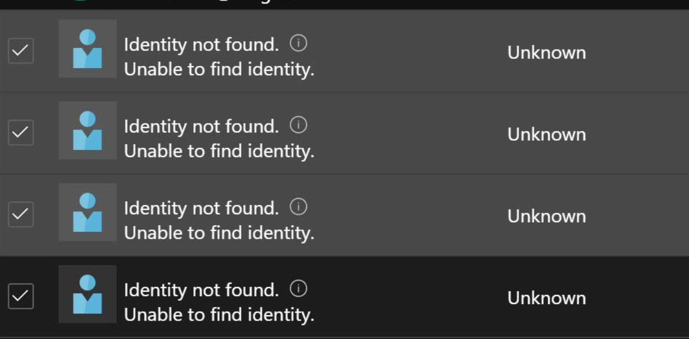

# Republic Air- S3RUS Solution Overview

## Craig is Awesome!

**DRAFT DIAGRAM- MANY CHANGES SINCE PROJECT STARTED. WILL BE UPDATED BY 10/19**


---

## AZURE DEVOPS PROJECT OVERVIEW
**Files:**
- azuredeploy.json: this is the ARM template that includes all of the resources that are deployed for this solution. It defines the resource and it's configurations.
- azuredeploy.parameters-dev.json: these are the ARM templates that contain the parameters referenced by the azuredeploy.json that are environmental specific.
- Both azuredeploy.json and azuredeploy.parameters.json are files that are found within each of the resource types folders within the Azure DevOps project repository. 


---
## SOLUTION OVERVIEW
This solution is to deploy a [Windows Virtual Desktop](https://docs.microsoft.com/en-us/azure/virtual-desktop/) instance to Republic Air's Azure environment to support the S3RUS application. The following Azure resources are provisioned:
:
- [**Azure Key Vault**](https://docs.microsoft.com/en-us/azure/key-vault/basic-concepts)- Used to store user account and password of account used to domain join virtual machines.
- [**Windows Virtual Desktop Host Pool**](https://docs.microsoft.com/en-us/azure/virtual-desktop/create-host-pools-azure-marketplace ) 
- [**Windows Virtual Desktop Application Group**](https://docs.microsoft.com/en-us/azure/virtual-desktop/manage-app-groups) The application group includes the desktop application group by default, and this is where users/groups are assigned applications. The only published applications are session desktops from each of the host pools. These four application groups are added to the Workspace during the last stage of the pipeline.
- [**Windows Virtual Desktop Workspace**](https://docs.microsoft.com/en-us/azure/virtual-desktop/environment-setup#workspaces): User workspace that includes all of the application groups that have been assigned to the user. All four application groups created by the deployments of the host pools are added to the **one** workspace used for this resources. This allows the user to be presented with four possible sessions to launch.
- [**Azure Storage Account**](https://docs.microsoft.com/en-us/azure/storage/common/storage-account-overview)  Used to store the application installation and update executables. There are two containers: artifacts, which contains the configuration.zip file referenced for the configuration of the service, and "nestedtemplates." [Nested Tempates](https://github.com/Azure/RDS-Templates/tree/master/ARM-wvd-templates/nestedtemplates) is a copy of the ARM templates for each of the four VM types (gallery, custom, etc.) from the Microsoft/Azure owned public Git Hub repository for Windows Virtual Desktop: https://github.com/Azure/RDS-Templates/tree/master/wvd-templates There are two types of Windows Virtual Desktop deployments: "Classic," and "ARM." The ARM deployment model templates are the ones that were modified and used for this solution.
- [**Availability Set**](https://docs.microsoft.com/en-us/azure/virtual-machines/windows/tutorial-availability-sets#availability-set-overview)- Used to provide high availability for Virtual Machine instances.
- [**Virtual Machine Resources**](https://docs.microsoft.com/en-us/azure/virtual-machines/windows/overview#related-resources): disk, network interface, virtual machine, etc.
- [**Azure Function App**](https://docs.microsoft.com/en-us/azure/azure-functions/functions-overview)This resource hosts the PowerShell logic that scales-up and scales-down the session hosts based on available sessions. This function is trigger timed and is scheduled to run every five minutes. The scaling threshold values are configured to reduce the session host count by one when the available sessions is greater than two. Alternatively, when the available sessions is less than two, another session host is launched. Each session host is configured to host a maximum of eight sessions. 
- - Four System Assigned Managed IDs are created as part of this solution/deployment and assigned the "Contributor" role for the resource group. These Managed IDs are used by each of the auto-scaling Function Apps to stop/start VMs. The life cycle management of these Managed IDs is tied to the resource they are associated with. When the resources are deleted, the IDs will automatically be removed as well.
  

   

- [**Azure App Service Plan***](https://docs.microsoft.com/en-us/azure/app-service/overview-hosting-plans) This provides the hosting resources necessary for the Azure Function app. There are four of these resources; one for each hosting pool. Each are configured as: Windows OS and [Consumption pricing plan/Y1: 0](https://docs.microsoft.com/en-us/azure/azure-resource-manager/management/azure-subscription-service-limits#app-service-limits)

---

## REFERENCE SCRIPTS
- **install-application.ps1:** script called by custom script extension ARM template resource (found in the 'resources' section of the "managedDisk-galleryvm.json. This script installs Notepad++ on target machines). **This file must be copied to storage account to allow it to be referenced by the template as the ADO project is not public and the decision was made to not reference external sources not owned/managed by Republic Air. This file is in source control. Once edited, changes committed to the master, the pipeline will file copy the installation script from the repository to the solution's BLOB storage account. 
- **run.ps1:** This script will scale out and in based on capacity utilization of the VMs. There are four of these; one for each environment. 
- **stop-function-app.ps1** This is the first stage of the pipeline and this script stops all of the function apps that are hosting the VM scaling PowerShell script. The pipeline will fail if the VMs are powered off. All eight sessions hosts need to be powered on and that's not possible if the function is still operating at a five-minute trigger.
- **start-vms.ps1** This is the second stage of the release pipeline and is used to ensure that all VMs are running. The pipeline will fail trying to update the VM, as these updates cannot be applied to a non-running VM.


---
## REFERENCE: PIPELINE DOCUMENTATION


Overview: There is only one pipeline for this application. This pipeline creates the resources needed for this solution as mentioned in the previous section
- No pipeline variables are used.
- All parameters are defined in the appropriate azuredeploy.parameters.json files.
- The pipeline is triggered by a pull request/merge to the master branch. Each task completion automatically triggers the start of the next task.

- The pipeline has been exported as a .json file and can be found in the repository as [bkup-10-18-2020.json](https://dev.azure.com/republicairways/AzureApp01/_git/S3RUS?path=%2FPIPELINE-BACKUP%2Fbkup-10-18-2020.json)

- There are branch policies in place that require pull request approval prior to being committed to the master branch. A minimum of one approver is required, and at the time of this writing, those that are defined as approvers are allowed to approve their own requests. It is recommended to require two approvers and one of them can't be the person that created the pull request.


- There are seven steps in the release pipeline


1. Stop Auto-Scaling Function Apps- Simple PowerShell script used to stop all of the Azure Function Apps that automatically scale up/down the session host VMs. If these are not stopped, they will continue to power off unneeded hosts. 
   
  ```powershell
  Stop-AzWebApp -ResourceGroupName az-eus2-prod-s3cpo-rg -Name s3rushp1-func
Stop-AzWebApp -ResourceGroupName az-eus2-prod-s3cpo-rg -Name s3rushp2-func
Stop-AzWebApp -ResourceGroupName az-eus2-prod-s3cpo-rg -Name s3rushp3-func
Stop-AzWebApp -ResourceGroupName az-eus2-prod-s3cpo-rg -Name s3rushp4-func 
```


2. Start All VMs- Simple PowerShell script that ensures all VMs are powered on. All VMs must be running as the deployment is unable to update non-running VMs.
   
```powershell 
Start-AzVM -ResourceGroupName az-eus2-prod-s3cpo-rg -Name s3rushp1-0 -NoWait
Start-AzVM -ResourceGroupName az-eus2-prod-s3cpo-rg -Name s3rushp1-1 -NoWait
Start-AzVM -ResourceGroupName az-eus2-prod-s3cpo-rg -Name s3rushp2-0 -NoWait
Start-AzVM -ResourceGroupName az-eus2-prod-s3cpo-rg -Name s3rushp2-1 -NoWait
Start-AzVM -ResourceGroupName az-eus2-prod-s3cpo-rg -Name s3rushp3-0 -NoWait
Start-AzVM -ResourceGroupName az-eus2-prod-s3cpo-rg -Name s3rushp3-1 -NoWait
Start-AzVM -ResourceGroupName az-eus2-prod-s3cpo-rg -Name s3rushp4-0 -NoWait
Start-AzVM -ResourceGroupName az-eus2-prod-s3cpo-rg -Name s3rushp4-1
```


3. Host Pool 1 Deployment- Includes several tasks that accomplish the following: 
   - Copies the "nested template" managedDisks-galleryvm.json file from the repository to an Azure Storage Account Container. This is needed as this ARM template resides in the project Azure DevOps repository and is version controlled. This file defines the VM configurations, but is largely used to provide version control for the extensions added to the VMs created during the host pool creation step.

```yaml
steps:
- task: AzurePowerShell@5
  displayName: 'Power down VM scale-up/scale-down function app'
  inputs:
azureSubscription: 'SC-Prod-Pipeline'
ScriptPath: '$(System.DefaultWorkingDirectory)/_S3RUS/SCRIPTS/stop-function-app.ps1'
azurePowerShellVersion: LatestVersion
```

   - Copies the Application Installation Custom Script Extension PowerShell script from the repository to an Azure Storage Account Container. This is needed as this ARM template resides in the project Azure DevOps repository and is version controlled. 

```yaml
steps:
- task: AzureFileCopy@4
  displayName: 'File Copy: Nested Template from Repo to Storage Account'
  inputs:
    SourcePath: '$(System.DefaultWorkingDirectory)/_S3RUS/ARM-TEMPLATES/VM-BUILD/managedDisks-galleryvm.json'
    azureSubscription: 'SC-Prod-Pipeline'
    Destination: AzureBlob
    storage: sts3rus
    ContainerName: nestedtemplates
```

- Deploys the hostpool creation ARM templates

```yaml
steps:
- task: AzureResourceManagerTemplateDeployment@3
  displayName: 'Deploy Host Pool 1: Windows Virtual Desktop Host Pool and Virtual Desktops'
  inputs:
    azureResourceManagerConnection: 'SC-Prod-Pipeline'
    subscriptionId: 'c1f8f29c-140e-44bb-803a-df7846a1931f'
    resourceGroupName: 'az-eus2-prod-s3cpo-rg'
    location: 'East US 2'
    csmFile: '$(System.DefaultWorkingDirectory)/_S3RUS/ARM-TEMPLATES/HOST-POOL/azuredeploy.json'
    csmParametersFile: '$(System.DefaultWorkingDirectory)/_S3RUS/ARM-TEMPLATES/HOST-POOL/azuredeploy.parameters.hostpool-1.json'
```

- Deploys the host session scaling function app

```yaml
steps:
- task: AzureResourceManagerTemplateDeployment@3
  displayName: 'Deploy Host Pool 1: Windows Virtual Desktop Host Pool and Virtual Desktops'
  inputs:
    azureResourceManagerConnection: 'SC-Prod-Pipeline'
    subscriptionId: 'c1f8f29c-140e-44bb-803a-df7846a1931f'
    resourceGroupName: 'az-eus2-prod-s3cpo-rg'
    location: 'East US 2'
    csmFile: '$(System.DefaultWorkingDirectory)/_S3RUS/ARM-TEMPLATES/HOST-POOL/azuredeploy.json'
    csmParametersFile: '$(System.DefaultWorkingDirectory)/_S3RUS/ARM-TEMPLATES/HOST-POOL/azuredeploy.parameters.hostpool-1.json'
```

1. "Host Pool 2 Deployment" (see step three)
2. "Host Pool 3 Deployment" (see step three)
3. "Host Pool 4 Deployment" (see step three)
4. "Add Each Application Group to WVD Workspace" ARM template that deploys a Windows Virtual Desktop Workspace, that includes the Application Groups that have been assigned to each user.

```json
        {
            "type": "Microsoft.DesktopVirtualization/workspaces",
            "apiVersion": "2019-12-10-preview",
            "name": "[parameters('applicationName')]",
            "location": "[parameters('location')]",
            "properties": {
                "applicationGroupReferences": [
                    "[parameters('applicationgroups_s3rushp2')]",
                    "[parameters('applicationgroups_s3rushp1')]",
                    "[parameters('applicationgroups_s3rushp4')]",
                    "[parameters('applicationgroups_s3rushp3')]"
                ]
            }
        }
```


---

## REFERENCE: DEPLOYMENT INSTRUCTIONS
To begin a release deployment
- Visit the [Azure DevOps project for this implementation](https://dev.azure.com/republicairways/AzureApp01). 
- Click on "Pipelines," then "Releases." The release that includes the WVD deployment tasks is called "Deploy S3RUS WVD." 
- Click on "Create Release." This release takes 30-40 minutes on average to complete.


---

## REFERENCE: TROUBLESHOOTING DEPLOYMENT ERRORS
There are many reasons a pipeline run can fail. This section provides some information around known issues, and steps to resolve.

- Error: unable to update stopped VM
  - Resolution: stop each function (there are four) and ensure VMs are then powered off before redeploying. After the pipeline runs, the function will start automatically.
- Error: "{"code":"DeploymentFailed","message":"At least one resource deployment operation failed. Please list deployment operations for details. Please see https://aka.ms/DeployOperations for usage details.","details":[{"code":"BadRequest","message":"{\r\n \"error\": {\r\n \"code\": \"RoleAssignmentUpdateNotPermitted\",\r\n \"message\": \"Tenant ID, application ID, principal ID, and scope are not allowed to be updated.\"\r\n }\r\n}"}]}"
  - Resolution: This is a known issue when attempting to automate the deployment of a resource that utilizes a system managed ID. This is resolved by going to the resource group -> access control (IAM) -> Role Assignments Check the IDs that say "Identity Not Found" and then remove.




---


## REFERENCE: USER ACCESS STRATEGY DOCUMENTATION

- All virtual desktops will be joined to the corporate.rjet.com domain.
- Access to the application will utilize Windows Active Directory security groups.
- Desktops will be assigned to Active Directory security group within the Application Group management plane, or via the ARM template used to deploy the resources.
- No "guest" accounts can be used. Only users Active Directory accounts that are being synched to Azure Active Directory can be granted access to Windows Virtual Desktops

---
 
## REFERENCE: AZURE INFRASTRUCTURE SUMMARY
- **Active Directory Tenant:** rjet.com
- **TenantID:** 2ebb9fda-6f05-43ed-8507-e83c949691ac
- **Region:** East US 2
- **Windows Virtual Desktop URL:** https://rdweb.wvd.microsoft.com/arm/webclient
- **Production Subscription Name:** App Prod 01
- **Production SubscriptionID:** c1f8f29c-140e-44bb-803a-df7846a1931f
- **Production Resource Group:** az-eus2-prod-s3cpo-rg
- **Service Principal:** az-rjet-prod-sc-devops-spn
- **Service Principal ClientID:** afca89bc-895a-4d6d-a277-cc3938952e5a
- **Service Principal ObjectID:** fd3fbfd9-a1ee-49b1-9db1-e9a3eeaea8e5
- **Production Key Vault Resource ID:** /subscriptions/c1f8f29c-140e-44bb-803a-df7846a1931f/resourceGroups/az-eus2-prod-s3cpo-rg/providers/Microsoft.KeyVault/vaults/s3rus-kv
- **Windows AD Join user account password Secret Name in Key Vault:** ad-pswd
- **Storage account:** sts3rus
- **s3rushp1-0-nic MAC Address:** 00-0D-3A-0D-DA-F1
- **s3rushp1-1-nic MAC Address:** 00-0D-3A-0D-D6-E2
- **s3rushp2-0-nic MAC Address:** 00-0D-3A-0F-90-E3
- **s3rushp2-1-nic MAC Address:** 00-0D-3A-0F-92-FB
- **s3rushp3-0-nic MAC Address:** 00-0D-3A-E5-A5-7F
- **s3rushp3-1-nic MAC Address:** 00-0D-3A-E5-A5-01
- **s3rushp4-0-nic MAC Address:** 00-0D-3A-0F-F5-67
- **s3rushp4-1-nic MAC Address:** 00-0D-3A-0F-F8-F7